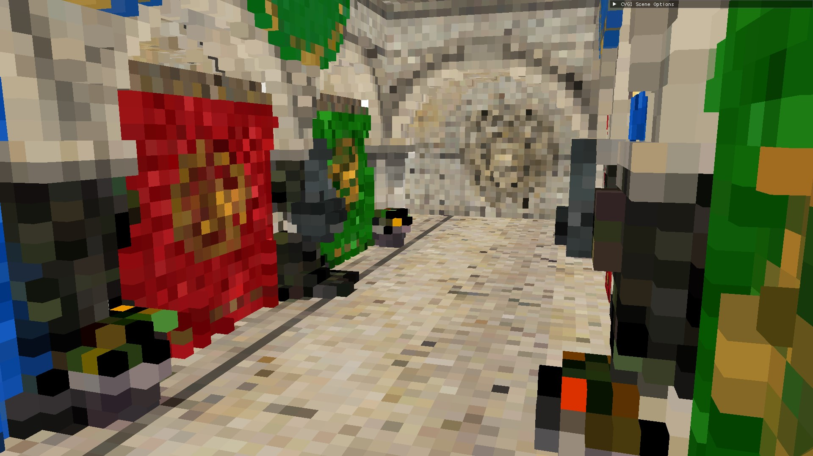
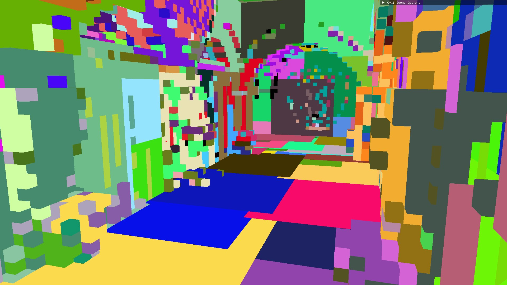
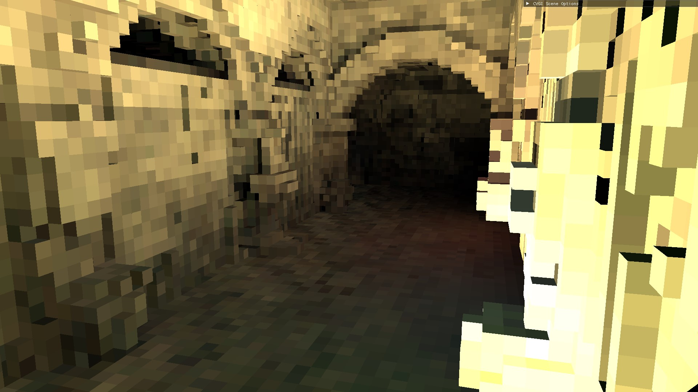

# Clustered-Voxel GI

The Clustered-Voxel GI subproject computes Global Illumination (GI) using a voxel clustering technique. The resulting radiance is computed for a static scene for simplicity; however with small modifications it would also be possible to compute GI for dynamic scenes aswell.

The radiance resulting from this computation can be visualized locally or sent to another machine.

## Table of Contents
1. [Clustered-Voxel GI](#clustered-voxel-gi)
2. [Implementation Details](#implementation-details)
3. [Techniques](#techniques)
   1. [Initialization Technique](#initialization-technique)
      1. [Scene Voxelization](#scene-voxelization)
      2. [Prefix Sum](#prefix-sum)
      3. [Clusterization](#clusterization)
      4. [AABBs and Acceleration Structures](#aabbs-and-acceleration-structures)
      5. [Cluster Visibility](#cluster-visibility)
   2. [Radiance Computation Techniques](#radiance-computation-techniques)
      1. [Light Voxel](#light-voxel)
      2. [Light Transport](#light-transport)
      3. [Gaussian Filtering](#gaussian-filtering)
4. [Compositing](#compositing)
   1. [Lerping and PostProcessing](#lerping-and-postprocessing)
6. [Transmitting Radiance](#transmitting-radiance)

## Implementation Details

The project was made using C++ and DirectX12 and it is based on the work by [Alejandro Cosin Ayerbe, Gustavo Patow](https://www.sciencedirect.com/science/article/pii/S009784932200005X), however it differs from the original implementation in the following ways.

* It uses [Fast-SLIC](https://github.com/Algy/fast-slic) instead of the original SLIC algorithm, as Fast-SLIC is specifically designed for real-time applications.
* It employs Ray-Tracing to perform cluster visibility calculations.
* Several adjustments have been made to optimize the transmission of radiance data across the network:
   * Radiance is packed more aggressively to reduce the data that needs to be transmitted.
   * The radiance computation process is broken down into more distinct steps, allowing for more flexible client workload management (e.g., adjusting the amount of work assigned to the client).
   * The implementation has been rewritten to use DX12 instead of Vulkan as the graphics API.
 
## Techniques
Global Illumination is computed as the results of various techniques that are chained together.

### Initialization Technique
Since the subproject only handles static scenes, most of these techniques are only used during the initialization step.

#### Scene Voxelization
The scene is initially voxelized into a cube grid of fixed size. The default grid resolutions are 64x64x64, 128x128x128, and 256x256x256, with higher resolutions providing greater accuracy but also increasing computational cost.

Voxelization is performed using a basic [Rasterization-based Voxel](https://developer.nvidia.com/content/basics-gpu-voxelization) algorithm. The scene is rendered into a 2D viewport with dimensions matching the voxelization resolution. To avoid cracks in the result, the scene is rendered from the perspective of three different orthographic cameras, each aligned with one of the scene axes. The projection with the largest area is chosen for the final rendering.

Since the voxelization size is the same across all sides of the volume, this process can be performed using a geometry shader instead of rendering the scene three separate times.

The result of the scene voxelization is stored in ByteAddressBuffer buffers, where each bit represents whether a voxel is present. This is achieved by using the voxel's linear coordinate instead of its 3D coordinates:

`uint linear_coord = (X * n * n) + (Y * n) + Z`

Where X, Y, Z represent the voxel's 3D coordinates, and n represents the voxel grid resolution, assumed to be the same for all sides.

To store information regarding the fragments that contributed to generating a voxel, additional buffers are created. These allow for the retrieval of information such as the voxel's color and normal by averaging the values from all the fragments that generated it. Three buffers are used for this purpose:

* Fragment Data Buffer: Contains the data for all fragments generated during the voxelization pass.
  * Example: `fragmentData[0] = { fragmentColor, fragmentNormal }`
* Fragment Linked List Buffer: Represents a linked list of fragments that belong to the same voxel. The indices represent the current fragment, and the values represent the next fragment in the list.
  * Example: `fragmentLinkedList[0] = 3` means that the fragment `0, 3` belong to the same voxel. Their data can be retrieved by accessing `fragmentData[0], fragmentData[3]`.
* First Fragment Index Buffer: Contains the index of the first fragment for each voxel.
  * Example: `firstFragmentIndex[2] = 0` means that the voxel with a linear coordinate of `2` has `fragmentLinkedList[0]` as its first fragment.
* Voxel Index Buffer: Contains for each fragment, the linear index of its voxel.
  * Example: `voxelIndexBuffer[4] = 5` means that the fragment `4` belongs to the voxel with linear coordinate `5`. 

|  Voxel Color |  Voxel Normal |
|:-------------------------------------------------:|:---------------------------------------------------------:|

---

#### Prefix Sum
After voxelizing the scene, we are left with two buffers, First Fragment Index and Voxel Index, which are unnecessarily large. This is due to the nature of voxelization, where most of the volume is empty space. As a result, there are large gaps in these buffers with no data.

To address this, a prefix sum algorithm is applied to compact the buffers, removing the empty space. However, this process makes it impossible to directly retrieve information regarding the fragments, as the indices in the buffers no longer correspond to the original fragment/voxel indices.

To solve this, two additional buffers `indirectionRank` and `indirectionIndex` are introduced during this step. These buffers allow us to retrieve the necessary information at the cost of multiple memory accesses.

#### Clusterization
Voxels are aggregated into clusters based on their similarity to simplify radiance calculations later on. This process is done using an algorithm based on [Fast-SLIC](https://github.com/Algy/fast-slic), with some modifications. 

* The algorithm is adapted to work in three dimensions
* Voxel similarity is defined by their normal rather than color
* Early terminations are possible when encountering empty voxels.

At the end of this step, the following buffers are generated:

* Cluster Buffer: A buffer containing the average position, normal, and color of each voxel. It also includes the index of the first voxel that belongs to each cluster.
* Voxel Cluster Map: A buffer where the indices represent the voxels, and the values indicate the cluster to which each voxel belongs.
* Voxel Linked List: Similar to the fragment linked list, the indices represent the voxel index, and the values represent the index of the next voxel in the list.

<figure>
   
   <figcaption> Voxel Clusters </figcaption>
</figure>

---

#### AABBs and Acceleration Structures
Axis-Aligned Bounding Boxes (AABBs) are generated from the voxels. The Min and Max values are derived from the voxel position in voxel space, with an offset of (-0.5, -0.5, -0.5) for the Min and (+0.5, +0.5, +0.5) for the Max.

These AABBs are placed in a buffer, which is then used to construct a Ray-Tracing Acceleration Structure.

#### Cluster visibility
In this step, Ray-Tracing hardware is leveraged to perform cluster visibility. For each voxel **face**, 256 rays are cast. For each ray, we test for intersections with other voxels. If an intersection is found, the voxel's cluster is retrieved and added to the list of clusters visible from that voxel face.

Since AABBs are used instead of triangles, a custom hit shader is required, which can result in slightly worse performance. It may be worth investigating whether generating triangles instead of AABBs for the acceleration structure could yield better performance.

### Radiance computation techniques
Radiance is computed using the following technique.

#### Light Voxel
In order to compute the radiance, lit voxels must first be identified. To achieve this, a depth map from the light's point of view is rendered into a texture. Then, each voxel is tested against this depth map by converting its coordinates to world space and subsequently to the light view space.

To correctly identify lit voxels, multiple points for each voxel are tested: one for each face and one for each corner, offset by a small amount. If any of these points is found to be visible from the camera, the entire voxel is considered lit.

For simplicity, the project currently uses a single light (the main directional light). However, supporting additional lights can be done with minimal modifications and little to no performance overhead, as testing the points against multiple depth maps can be handled in the same pass.

<figure>
   
   <figcaption> Lit Voxels </figcaption>
</figure>

---

#### Light Transport
The actual radiance computation occurs in this step. First, voxels visible from the camera are identified using the same approach as in the previous step. A scene depth map is rendered from the camera's point of view, and voxels are tested against it in the same manner.

Radiance is then computed for each visible voxel face. Since clusters visible from each face are known from the cluster visibility step, all that remains is to aggregate the radiance of each visible cluster. This is done using either the position, normal, color, and incoming light of each voxel within the cluster, or using the cluster averages, depending on the distance of the face from the cluster.

An additional buffer is used to keep track of the voxel that have been updated. Whenever one of this voxel is seen by the camera it is skipped and its radiance is recomputed. The buffer is cleared if the light is updated in any way.

<figure>
   
   <figcaption> Raw Radiance </figcaption>
</figure>

---

#### Gaussian Filtering
The previous step results in radiance being computed per voxel face, which can lead to a blocky appearance. To smooth out the radiance, a Gaussian filtering pass is applied twice: once to the initial radiance results and once again to the filtered result.

<figure>
   
   <figcaption> Filtered Radiance </figcaption>
</figure>

---

## Compositing
Once the radiance is computed, it can be composited into the final frame. The scene is rendered using common raster techniques; for each generated fragment its corresponding voxel is retrieved by converting the fragment position into voxel space. It is possible that the corresponding voxels of some fragments are empty, in which case the closest voxel is selected. Once a voxel is found for the current fragment, a bilinear interpolation is performed between close voxels to avoid artifacts due to differences in radiance values.

### Lerping and PostProcessing
After compositing, two additional small steps are performed: Lerping and PostProcessing.

The radiance is not immediately displayed but is instead lerped using an Ease-Out Cubic equation:
`float easeT = 1.0 - pow(1.0 - t, 3.0);` with `t = timeSinceLerpStart / maxLerpTime`.
This is done to avoid radiance popping, especially when the computation is expensive. This often happens when the light is updated and many voxels are visible from the camera's point of view (e.g., when the scene is viewed from a distant angle).

A post-processing shader is then applied to smooth out small irregularities in the radiance. The shader performs a Gaussian blur on the radiance in screen space. For each fragment, the radiance is blurred within a neighborhood of arbitrary size, but only for fragments whose world distance does not exceed a specified maximum threshold.

<figure>
   
   <figcaption> Final Result </figcaption>
</figure>

---

## Transmitting Radiance
When a user connects to the server, they take control of the scene camera, This approach is used for simplicity. The server camera is synchronized with the user camera at regular intervals, and the radiance visible from the server is sent to the [client](../LocalIllumination).
While the current project only supports one camera, it is possible to extend this to multiple cameras. Since the radiance computation can be reused, the cost of computing radiance for multiple cameras can be amortized.

There are two points where radiance could be transmitted to the client

* Radiance is computed exclusively on server, and the client only perform compositing.
  * This approach requires minimal computational capability from the client, as compositing can be done very quickly. However, it does require a stable connection to avoid light artifacts. Additionally, due to the way Gaussian filtering is computed, this method requires more bandwidth.
* Light Transport is computed on server, client performs gaussian filtering and compositing.
  * This is the responsibility division used in this project. In this setup, the server handles the most computationally expensive parts of the process, while the client performs the Gaussian filtering pass on top of the compositing. This approach reduces bandwidth usage and provides better responsiveness, though it adds a small computational overhead for the client.

Radiance computed before transmission is saved into a packed buffer of 32-bit elements. In this buffer, 10 bits are assigned to the Red color, 12 bits to the Green color, and the remaining 10 bits to the Blue. Finally, the buffer is compressed using [zstd](https://github.com/facebook/zstd).

