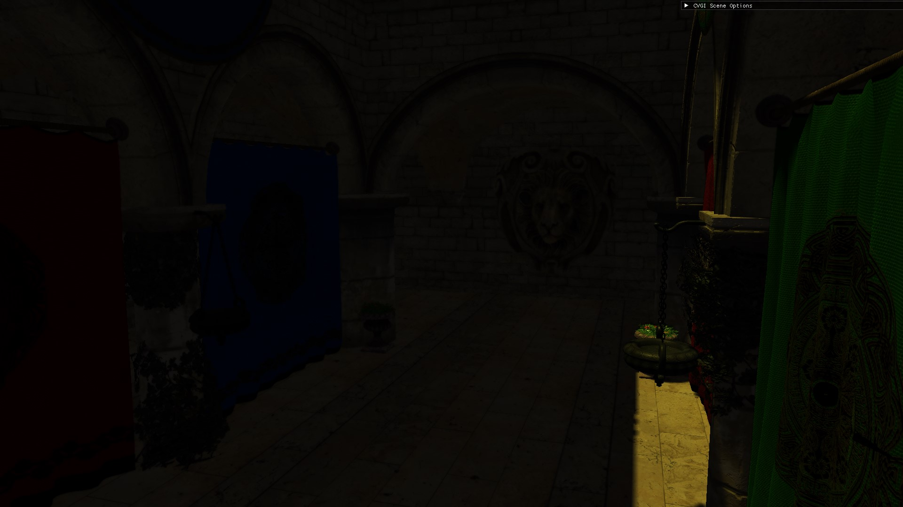

# Local Illumination
The Local Illumination project is a simple scene renderer created with C++ and DirectX12. The scene is rendered using only direct illumination. However, the application can connect to a [server](../ClusteredVoxelGI) to remotely compute radiance for global illumination, allowing for more realistic lighting in the scene.

This project also implements a encoder and video streamer to showcase real-time video streaming. The video streaming feature demonstrates how the scene, including computed radiance or the entire frame, can be streamed to a client in real time.

|  Ambient Light |  Clustered-Voxel Global Illumination |
|:-------------------------------------------------:|:---------------------------------------------------------:|

## Global Illumination
The scene rendered does not compute Global Illumination (GI) on its own; instead, it uses a small constant value as ambient light. Global Illumination is achieved by connecting to a server application that provides the required radiance data.

This process involves connecting to the server and sending camera and lighting data (e.g., camera and light position, rotation, light color, and light intensity). The server computes the new radiance for the updated configuration and sends it back to the client.

The data received contains raw radiance values for each voxel face visible from the client's last sent camera data point of view, with a small padding added to the camera frustum to account for potential network delays. The client uses this radiance to perform a [gaussian filtering pass](../ClusterdVoxelGI/README.md#gaussian-filtering) and [composites](../ClusterdVoxelGI/README.md#compositing) it to screen. 

Even though the server already tracks the faces for which radiance has been computed, the client also does this to avoid recomputing gaussian filtering. If the new computed radiance is not received in a timely manner, the client simply reuses the old radiance data. Once the new data is received, it is [lerped](../ClusterdVoxelGI/README.md#lerping-and-postprocessing) from the old one.

---

https://github.com/user-attachments/assets/8acb3a7f-1877-4195-a227-5454f42b3370

*When the client updates any of the light properties, the server recomputes the radiance*

https://github.com/user-attachments/assets/59d5bfa6-5993-4b41-b681-2966d2cd12f2

## Encoding and Streaming
The application also provides a sample real-time video streaming functionality. In this case, the application acts as a server, encoding and streaming frames to a client.
Encoding is achieved using the [NVIDIA Video Codec SDK](https://developer.nvidia.com/video-codec-sdk),  which leverages the GPU to perform fast video encoding and offers a series of convenient streaming profiles. The video is then streamed to the client using [FFmpeg](https://www.ffmpeg.org/).
