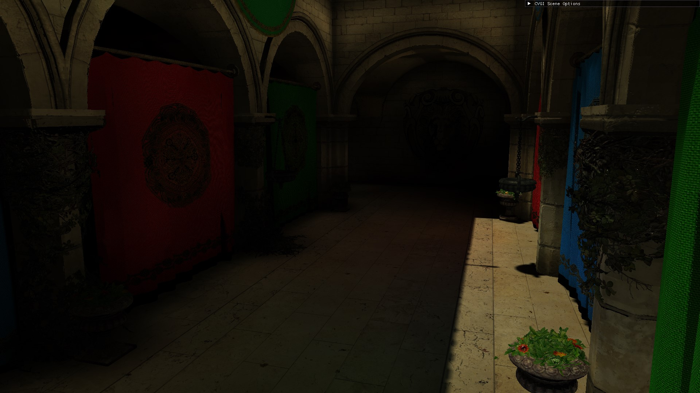
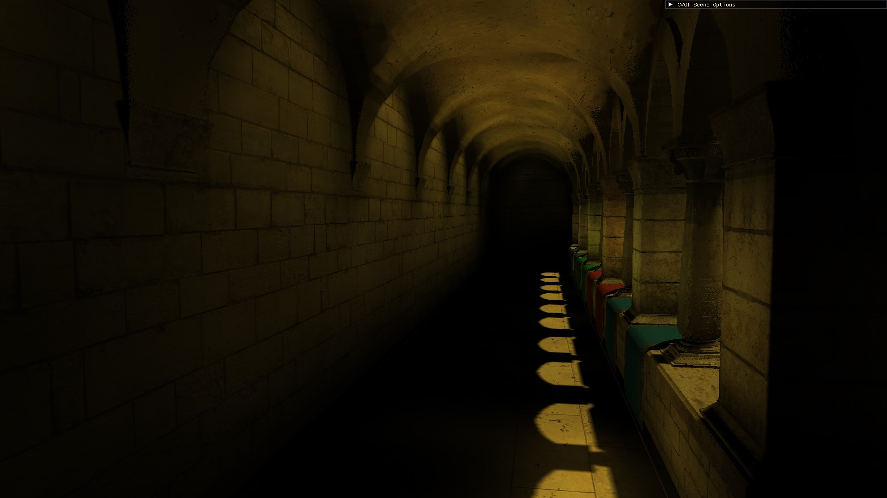
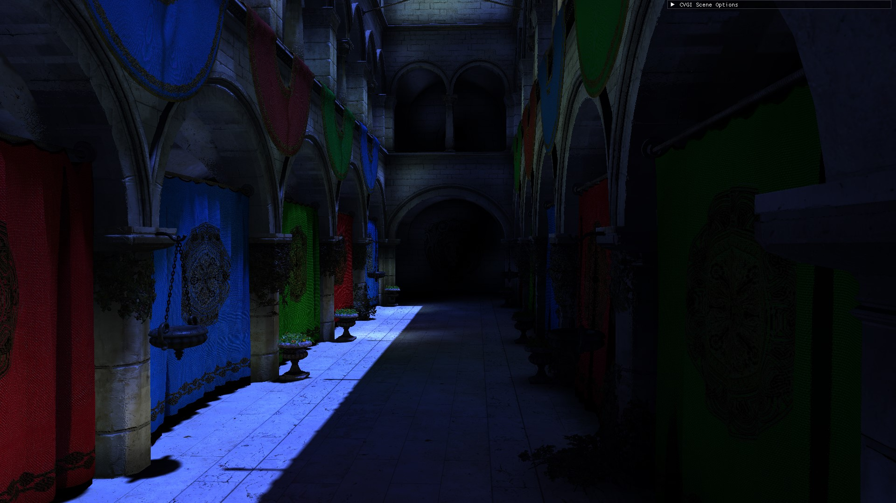
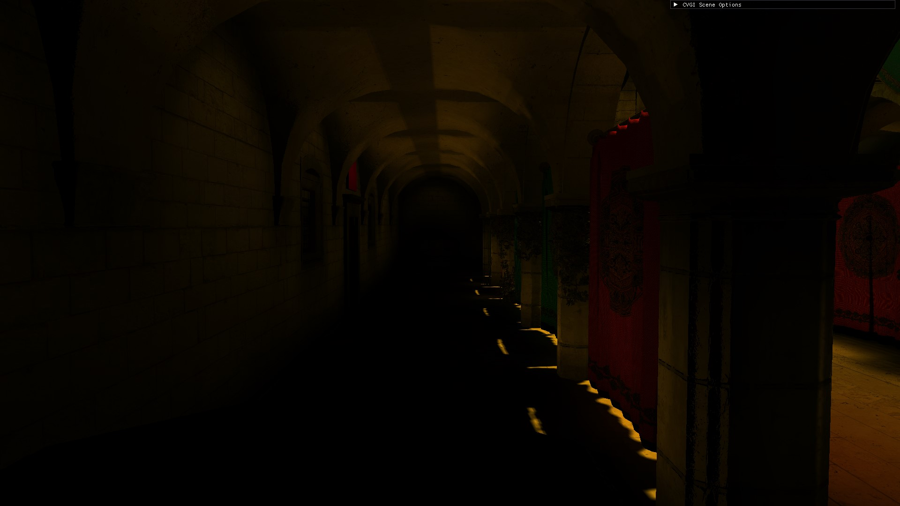
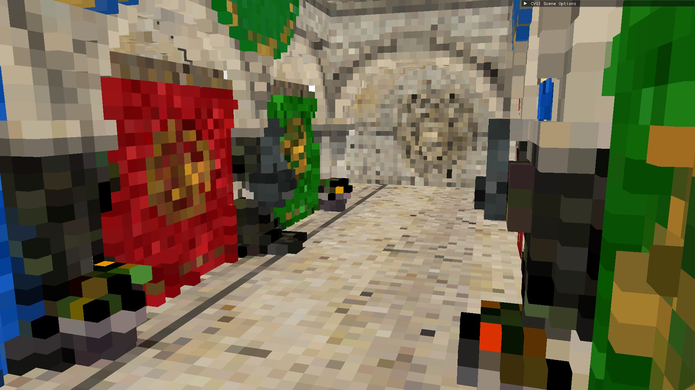
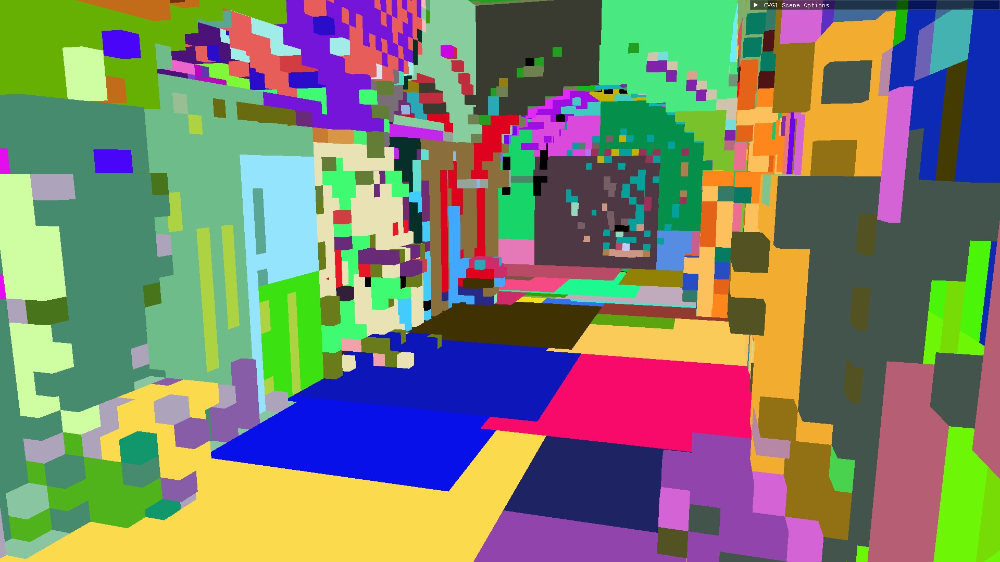
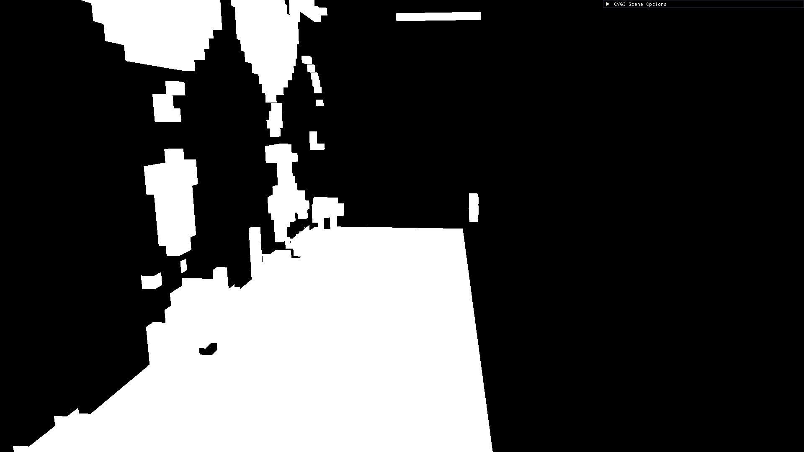
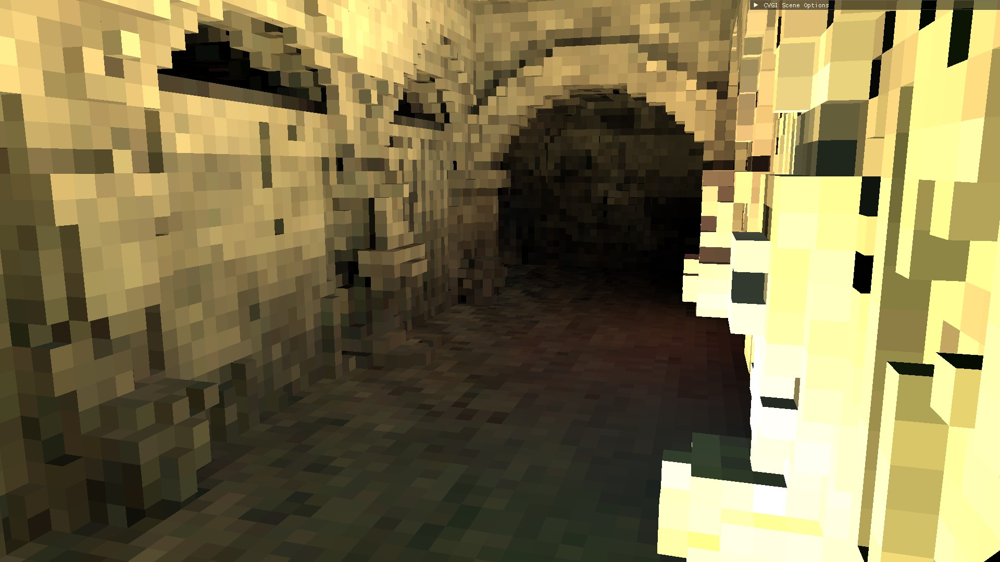
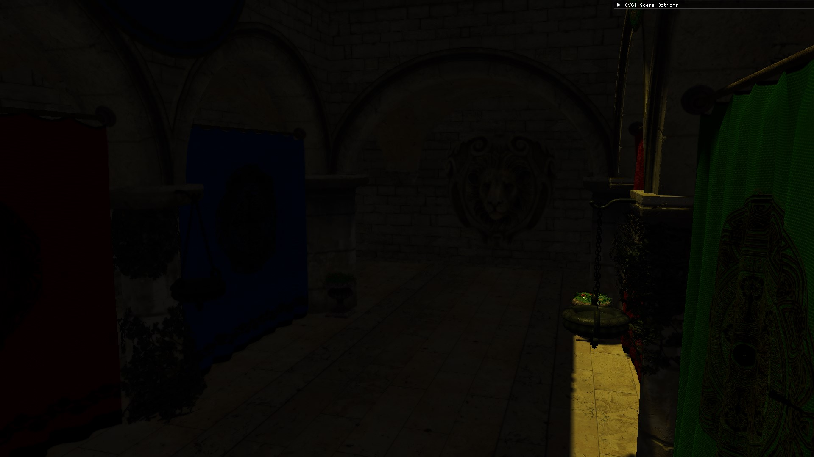
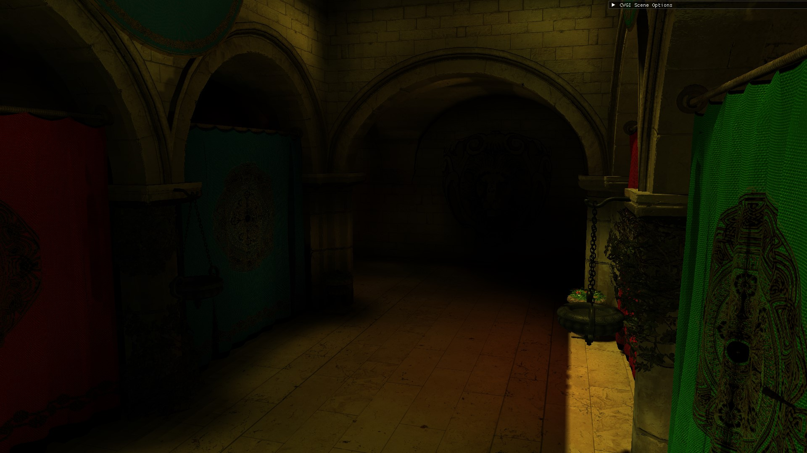

# DX12 Real-Time Global Illumination (GI) Project

This repository contains a real-time global illumination (RTGI) implementation made with C++ and DirectX 12. It showcases a distributed rendering pipeline where global illumination can be computed on one machine and used by another.

## Table of Contents

1. [Introduction](#introduction)
2. [Requirements](#requirements)
3. [Clustered-Voxel GI](#clustered-voxel-gi)
4. [Local Illumination](#local-illumination)
5. [Streaming Client](#streaming-client)
6. [Building the Project](#building-the-project)
7. [Project Structure](#project-structure)
8. [Usage](#usage)
9. [Known Issues](#known-issues)
10. [Credits](#credits)

|  | |
|:-------------------------------------------------:|:---------------------------------------------------------:|
|  | |

## Introduction

This project demonstrates a distributed rendering system using DX12, where rendering computations are offloaded to a server, and the results are streamed to the client in real-time. In traditional distributed rendering, the server handles most of the rendering workload, streaming the final image to the client [^1]. This allows users with lower-end hardware to run the application without needing specialized resources, while also simplifying development by reducing the need to optimize for various system configurations.

However, real-time streaming introduces challenges. Unlike standard video streaming, real-time rendering requires constant user input. Video buffering isn't feasible because the scene depends entirely on user actions. This means a stable internet connection with sufficient bandwidth is essential, and users may experience input lag due to the client being unaware of the scene's current state.
Moreover, most modern devices have some sort of 3D rendering capabilities; thus, by relying on the device solely as a decoder with an internet connection, we are underutilizing its potential. A better approach would be to leverage the device's capabilities to render a simplified version of the scene, while using an external server to compute additional details or augmentation. This method not only maximizes the use of the user's hardware but also helps mitigate input lag, as the simplified scene provides immediate feedback to user actions.

In this project, the rendering workload is split between the server and the client by separating lighting computations into direct and indirect (GI) lighting. The client renders the scene using standard rasterization techniques to compute direct lighting, while the server calculates the global illumination and sends it to the client. The client then composites the illumination with the direct lighting to produce the final frame. 

While this approach is not new and has been studied previously [^2], this repository is dedicated to revisiting the solution by employing a Clustered-Voxel technique to perform the global illumination calculations. 

## Clustered-Voxel GI
The clustered-Voxel GI project showcases how to compute the global illumination remotely. It is based on a clustered voxel technique [^3] to compute the indirect lightning. The results can be displayed locally, or sent remotely to another machine.

A more detailed description of the project can be found [here](ClusteredVoxelGI/README.md).

|  | |
|:-------------------------------------------------:|:---------------------------------------------------------:|
|  | |

## Local Illumination
The Local Illumination project showcases two different types of distributed rendering: distributed global illumination and real-time video streaming.
In both cases, a simple demo scene is rendered. This scene does not compute global illumination but uses a small constant value for ambient lighting.

For distributed global illumination, this project functions as the client, receiving GI data from the server and using it to composite the final frame on the screen.
For real-time video streaming, this project serves as the server. It utilizes hardware acceleration to encode the rendered frame into a video and stream it to the client.

A more detailed description of the project can be found [here](LocalIllumination/README.md).

|  Ambient only |  Network Radiance|
|:-------------------------------------------------:|:---------------------------------------------------------:|

## Streaming Client
The Streaming Client project showcases a client application for real-time video streaming. It uses hardware acceleration to decode the video stream and display it on the screen.

A more detailed description of the project can be found [here](StreamingClient/README.md).

## Requirements

- Visual Studio 2017 or later with DX12 SDK
- Windows 10 or later
- CMake for building the project
- NVIDIA GPU with Ray-Tracing capabilities.

## Building the Project

1. Clone this repository
2. Launch the file `GenerateSolution.bat` to build the solution

You should find a `build_vs(your_vs_version)` folder with the solution inside.

## Project Structure

 The project is structured into three subprojects:

* ClusteredVoxelGI: Computes global illumination using voxel clustering and ray-tracing. The results can be visualized locally or sent to another machine for compositing.
* LocalIllumination: Renders a basic 3D scene using commmon rasterization techniques. It can receive radiance data from another machine and use it to composite a final frame to screen. It can also act as a server for real-time video streaming.
* StreamingClient: An implementation of a simple real-time video streaming.

## Usage
Information regarding the projects usage can be found [here](USAGE.md).

## Known Issues
Some issues remain unresolved, as addressing them would increase the complexity of the application. The main goal of this project is to showcase a distributed rendering system in a simple and clear manner.

### Lightning
Ideal Lightning configuration are dependent on voxel resolution and clusterization level

### Networking
* The application requires minimal packet loss (<0.5%), as solutions to combat packet loss have not been added for simplicity
* Repeatedly connecting and disconnecting from a server may require application restart

## Credits
[Microsoft Mini-Engine](https://github.com/microsoft/DirectX-Graphics-Samples/tree/master/MiniEngine) and [Introduction to 3D Game Programming With DirectX 12](https://www.d3dcoder.net/d3d12.htm) were used as a reference for most of the DX12 library files.

[Clustered voxel real-time global illumination](https://www.sciencedirect.com/science/article/pii/S009784932200005X) was used as the basis of the GI algorithm.

[NVIDIA Video Codec SKD](https://developer.nvidia.com/video-codec-sdk) was used as a reference for the video encoder / decoder files.

[FFmpeg](https://www.ffmpeg.org/) for video streaming

[zstd](https://github.com/facebook/zstd) for performing compression

[ENet](http://enet.bespin.org/index.html) for the network files.

[Dear imGUI](https://github.com/ocornut/imgui) for the GUI

## References
[^1]: https://www.nvidia.com/en-us/geforce-now/
[^2]: https://research.nvidia.com/publication/2021-07_distributed-decoupled-system-losslessly-streaming-dynamic-light-probes-thin
[^3]: https://www.sciencedirect.com/science/article/pii/S009784932200005X
[^4]: https://github.com/Algy/fast-slic
[^5]: https://dl.acm.org/doi/10.1109/TPAMI.2012.120

---

https://github.com/user-attachments/assets/59d5bfa6-5993-4b41-b681-2966d2cd12f2

https://github.com/user-attachments/assets/8acb3a7f-1877-4195-a227-5454f42b3370

