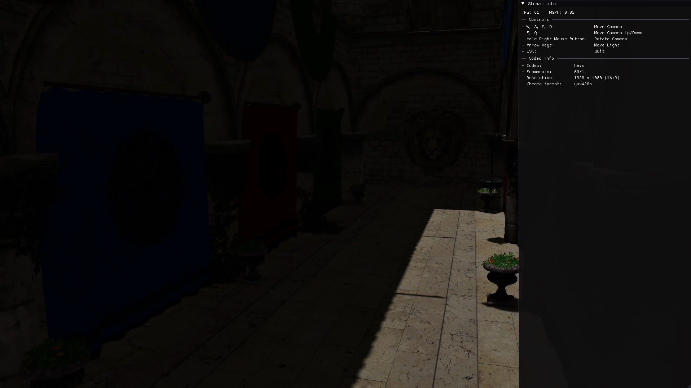

# Streaming Client
This project showcases a sample client for a real-time video streaming application, made with C++ and OpenGL.

## Decoding and Streaming
The application uses [NVIDIA Codec SDK](https://developer.nvidia.com/video-codec-sdk) for hardware-accelerated video decoding and [FFmpeg](https://www.ffmpeg.org/) to connect to the [video streaming server application](../LocalIllumination).
The client connects to the server and periodically sends its input data to the streaming server, allowing it to interact with the scene.

---

